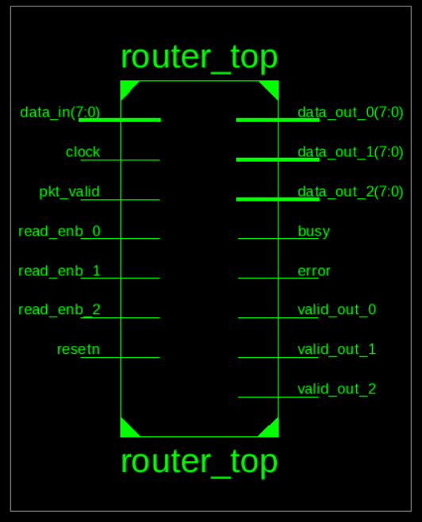

# 🚦 Router 1x3 – Verilog HDL Project

This project implements a **1x3 packet router** using **Verilog HDL**, where a single source can send packets to any of the three destinations based on the address specified in the packet header.

Designed and simulated using **Xilinx ISE** on a fully synchronous architecture.

---

## 🧠 Project Overview

- **Single Source → Three Destinations**: Only one packet is sent at a time from the source, but all three destinations can read their respective data **simultaneously** if available.
- The router processes packets divided into **Header**, **Payload**, and **Parity** sections.

---

## 🧱 Block-Level Design

The design uses **6 major modules**:

### 1️⃣ FSM Controller  

The central controller of the router:

- Drives the operation by transitioning between states based on input signals.
- Generates control signals for synchronization, registers, and FIFOs.

### 2️⃣ Synchronizer  

Handles packet routing logic based on header:

- Generates **write enable** signals for FIFOs based on destination address in the header.
- Manages **FIFO full** detection per FIFO.
- Drives **valid out** signals to inform destinations when data is available.
- Controls **soft reset** if a destination doesn’t read data within **30 clock cycles** of availability.

### 3️⃣ Register Block  

Handles internal data storage and checks:

- `header register`: stores header byte.
- `fifo full state`: holds data when FIFO is full.
- `internal parity`: calculated using XOR of payload data.
- `parity register`: stores parity byte from source and checks for mismatch (error detection).

### 4️⃣ FIFO Buffers (x3)  

Each destination has a dedicated FIFO:

- Stores the payload data addressed to it.
- Outputs data when valid and destination reads it.

---

## 📦 Packet Structure

```
+-------------+-------------------+---------------+
| Header Byte | Payload (n Bytes) | Parity Byte   |
+-------------+-------------------+---------------+
```

- **Header Byte**:
  - Bits [7:2] → Payload length (6 bits, up to 64 bytes)
  - Bits [1:0] → Destination address (2 bits for 3 destinations)
- **Payload**: Actual data bytes
- **Parity**: Single byte for error detection

---

## 🛠️ Tools Used

- **Xilinx ISE** (RTL design, synthesis & simulation)
- **Linux Terminal** (project setup, navigation)
- **Verilog HDL** (hardware description language)

---

## 📌 Key Features

- Synchronous design
- Dynamic routing using address decoding
- Separate FIFOs with independent control logic
- Timeout-based soft reset if data isn’t read
- Parity error detection mechanism

---

## 📁 Folder Structure

```
Router-1x3/
├── Docs/        # Screenshots
├── rtl/         # RTL modules (.v files)
├── tb/          # Testbench files
└── README.md
```

---

## 🔍 What You’ll Learn

- How to build modular Verilog architectures
- FSM design and control logic
- Packet parsing and routing
- FIFO and register block integration
- Simulation and debug workflow using Xilinx

---

## 🧠 Takeaway

This project sharpened my skills in:

- **Modular Verilog design**
- **FSM and control flow**
- **Signal synchronization**
- **Digital communication protocols**

---

## 🖼️ Screenshots



## 🏷️ Tags

`verilog` `vlsi` `router` `xilinx` `hdl` `rtl` `testbench` `fsm` `fifo` `digital-logic` `synchronous-design`

---

## 🙋‍♂️ Author

**Hithaishi S R**  
Aspiring VLSI Design & Verification Engineer  
🔗 [LinkedIn](https://linkedin.com/in/hithaishisr)
